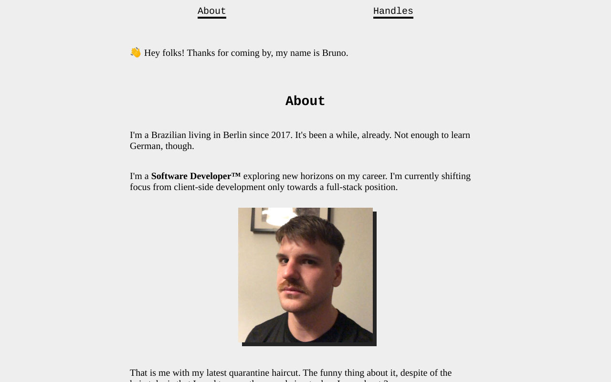

# My Website

There's nothing much to say. This is the code that runs on [my website](https://brunokonrad.com), hosted on [Vercel](https://vercel.com).

The intention is to keep it as simple as possible, using HTML & CSS directly. In case of need, I'll start to extend it, addin new tools if they're needed. For the first version, this is more than enough.



## Deployment

You can deploy a new version of the website by, first, installing the dependencies:

```
npm install
```

Then, you can run either one of these commands.

To deploy to staging only:

```
npm run deploy
```

To deploy to production only:

```
npm run deploy-prod
```

To deploy to all environments:

```
npm run deploy-all
```

✨ Happy hacking, Bruno!
